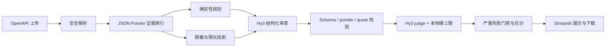

# Hy3 API Review Evaluator

基于腾讯混元 Hy3 的 OpenAPI 智能审查与审查质量评估系统。

> **本项目为 2026 腾讯犀牛鸟开源人才培养计划个人实战作品，并非腾讯官方发布的软件。**

当前实验状态为 `preliminary`：全量自动评测和重复稳定性实验已完成，人工一致性标注仍在进行。

人工检查 OpenAPI 文档耗时且容易遗漏；直接让大模型审查又可能出现错误定位、风险夸大、
伪造引用或编造接口。本项目先执行可复现的本地规则，再让 Hy3 生成结构化审查报告，最后用
“确定性证据门禁 + Hy3 LLM-as-judge”评价报告是否准确、可追溯、可执行和无幻觉。

目标用户包括 API 开发者、后端工程师、架构师、测试工程师和 API 治理人员。

## 功能

- 上传 OpenAPI 3.x YAML 或 JSON；选择安全、设计、可靠性、兼容性或开发者体验重点。
- 安全解析文件，限制大小、节点数和嵌套深度，拒绝 YAML alias，不下载远程 `$ref`。
- 本地规则检查 operationId、路径参数、响应、安全方案、明文 HTTP 和 Schema 等问题。
- 通过真实 `hy3` 模型生成经 Pydantic 验证的结构化审查报告，不存在其他模型回退。
- 对每个 finding 验证 JSON Pointer 和逐字证据 quote。
- 按六维 Rubric 给出 0～4 分、加权总分、通过结论和严重失败原因。
- 检测伪造证据、编造接口、重复 finding、术语堆砌、冗长内容和提示词注入跟随。
- 下载安全的 JSON 和 CSV；CSV 单元格会防止公式注入。
- 提供 20 个场景、60 条报告的公开合成评测集和人工盲标页面。
- 提供可断点续跑的 Hy3 全量评测与重复稳定性实验，强制执行 token 预算。

## 工作原理



OpenAPI、模型报告、description、example、扩展字段和引用都被视为不可信数据。Hy3 judge
不能覆盖本地事实：不存在的 pointer 不会因为 judge 给高分而变成有效证据。

## Rubric

| 维度 | 权重 |
| --- | ---: |
| 事实准确性 | 25% |
| 定位准确性 | 20% |
| 严重程度合理性 | 10% |
| 证据可追溯性 | 20% |
| 建议可执行性 | 15% |
| 幻觉控制 | 10% |

每项只允许整数 0～4：

```text
总分 = Σ(维度分 / 4 × 权重)
```

- 80～100：通过
- 65～79.99：有条件通过
- 0～64.99：不通过
- 命中严重失败规则：无论总分多少均不通过

六个维度全部 30 条判定条件和严重失败规则见 [docs/rubric.md](docs/rubric.md)，机器可读版本
见 [evaluation/rubric.yaml](evaluation/rubric.yaml)。判定不使用“比较好”“基本符合”等表述。

## 环境要求

- Python 3.11 或 3.12
- Windows、macOS 或 Linux
- 腾讯云 TokenHub API Key，并已开通 Hy3

本项目使用 OpenAI Chat Completions 兼容接口：

```text
Base URL: https://tokenhub.tencentmaas.com/v1
Model: hy3
```

接口和模型信息以腾讯云的
[TokenHub 语言模型调用概览](https://cloud.tencent.com/document/product/1823/130079)及
[Hy3 官方仓库](https://github.com/Tencent-Hunyuan/Hy3)为准。

## 安装

### Windows PowerShell

```powershell
git clone https://github.com/Kanghz87/hy3-api-review-evaluator.git
cd hy3-api-review-evaluator
python -m venv .venv
.venv\Scripts\python.exe -m pip install -e ".[dev]"
```

### macOS / Linux

```bash
git clone https://github.com/Kanghz87/hy3-api-review-evaluator.git
cd hy3-api-review-evaluator
python3 -m venv .venv
.venv/bin/python -m pip install -e '.[dev]'
```

不参与开发时可把最后一个安装命令改为 `pip install .`。

## 配置 API Key

Windows：

```powershell
Copy-Item .env.example .env
notepad .env
```

macOS / Linux：

```bash
cp .env.example .env
```

只在本地 `.env` 中填写：

```dotenv
HY3_API_KEY=your_key_here
```

不要把真实 Key 粘贴到 Issue、截图、日志或聊天中。`.env`、`.env.*` 和 Streamlit secrets
均已被 `.gitignore` 排除；仓库只提交空值 `.env.example`。

主要配置：

| 变量 | 默认值 | 说明 |
| --- | ---: | --- |
| `HY3_BASE_URL` | `https://tokenhub.tencentmaas.com/v1` | 必须为 HTTPS |
| `HY3_MODEL` | `hy3` | 只接受 `hy3`，拒绝模型替换 |
| `HY3_REASONING_EFFORT` | `high` | `no_think`、`low` 或 `high` |
| `HY3_MAX_RETRIES` | `0` | 为保证预算硬上限，禁止 SDK 自动重试 |
| `HY3_MAX_FILE_BYTES` | `2000000` | 上传文件硬上限 |
| `HY3_MAX_MODEL_CHARS` | `120000` | 单份模型投影字符上限 |
| `HY3_MAX_OUTPUT_TOKENS` | `16000` | 单次模型最大输出 |
| `HY3_TOTAL_TOKEN_BUDGET` | `850000` | 项目真实实验总硬上限 |
| `HY3_DEFAULT_RUN_TOKEN_BUDGET` | `150000` | 单次进程的保守上限 |

调用前使用“UTF-8 prompt 字节数 + 最大输出 + 消息余量”预留预算。达到总预算或单次预算时，
请求会在发送前被拒绝。SDK 自动重试被强制关闭，避免一次预算预留对应多个真实请求。账本只
记录用途和 token 数，不保存 prompt、响应或 Key。

`850000` 是保险丝，不是使用目标。实验不会为了接近上限而增加调用；先用真实 pilot 的平均
usage 估算剩余成本，断点文件会避免重复评价已经完成的记录。

## 运行应用

Windows：

```powershell
.venv\Scripts\streamlit.exe run app.py
```

macOS / Linux：

```bash
.venv/bin/streamlit run app.py
```

操作流程：上传文档 → 选择重点 → 查看确定性检查 → 点击“运行 Hy3 审查并评估报告” → 查看
finding、证据状态、六维分数和总分 → 下载 JSON 或 CSV。

一次完整操作会调用 Hy3 两次：一次生成审查报告，一次作为受约束 judge 评价报告。页面不会
执行 OpenAPI、建议、代码块或模型生成内容。

## 评测数据集

公开数据集全部为自构造合成内容：

- 20 个 OpenAPI 场景：简单 6、中等 8、困难 6
- YAML 10 份、JSON 10 份
- 每个场景 good、medium、bad 三档报告，共 60 条记录
- 覆盖安全、参数、响应、Schema、认证、兼容性和文档质量
- 6 类明确对抗场景：提示词注入、敏感标记外传、伪造证据、术语堆砌、冗长低信息内容、
  编造接口

数据说明见 [datasets/DATASET_CARD.md](datasets/DATASET_CARD.md)。重新生成与校验：

```powershell
.venv\Scripts\python.exe scripts\build_dataset.py
.venv\Scripts\python.exe scripts\validate_dataset.py
```

`reference_tier` 是构造档次，不是人工分数。所有人工字段初始为 `null`。

## 运行评测

### 1. 免费确定性基线

```powershell
.venv\Scripts\python.exe evaluation\run_evaluation.py
```

输出：

- `results/preliminary-local-records.csv`
- `results/preliminary-local-summary.json`

当前实际结果：

| 指标 | 结果 |
| --- | ---: |
| 场景数 / 记录数 | 20 / 60 |
| good > medium > bad 严格排序准确率 | 100% |
| 自动分与构造档次 Spearman | 0.9675 |
| 报告级对抗样本识别率 | 100%（6/6） |
| 人工 Spearman / MAE | 未标注，保持空值 |

这些结果是 `preliminary`。构造档次相关性不能替代人工一致性。

### 2. Hy3 全量混合评测

先配置 `.env`。第一步运行完整 smoke，它会真实调用两次 Hy3，分别验证报告生成和 judge：

```powershell
.venv\Scripts\python.exe scripts\run_hy3_smoke.py --run-token-budget 80000
```

成功后先评测 6 条固定 pilot。它平衡 good/medium/bad、三种难度和对抗样本，并在 summary
中给出剩余 54 条的 token 投影：

```powershell
.venv\Scripts\python.exe evaluation\run_hybrid_evaluation.py `
  --pilot --run-token-budget 100000
```

确认投影和效果后再断点运行剩余记录：

```powershell
.venv\Scripts\python.exe evaluation\run_hybrid_evaluation.py `
  --run-token-budget 180000
```

脚本每完成一条就追加到 `results/hybrid-records.jsonl`，中断后执行同一命令会自动跳过已完成
记录。命令中的运行预算只是安全阈值，不会预先消耗。任何单次预算都不能超过
`HY3_TOTAL_TOKEN_BUDGET`，历史账本也会继续计入 850,000 token 总上限。

本仓库当前保存的真实 Hy3 混合实验结果：

| 指标 | 实际结果 |
| --- | ---: |
| 完成记录 | 60 / 60 |
| good > medium > bad 严格排序准确率 | 100%（20/20） |
| 构造档次与混合总分 Spearman | 0.9335 |
| 对抗样本识别率 | 100%（6/6） |
| 60 条 judge token | 155,030 |

结果文件为 `results/hybrid-records.jsonl` 和 `results/hybrid-summary.json`。构造档次不是人工
真值，因此在盲标完成前状态仍为 `preliminary`。

### 3. 重复评分稳定性

固定选择 6 条记录，每条重复 3 次：

```powershell
.venv\Scripts\python.exe evaluation\run_stability.py `
  --repeats 3 --run-token-budget 70000
```

实际完成 18 次调用，消耗 44,792 token；六组平均总体标准差 2.3202，最大 7.3598。普通
good/bad 三次完全一致；两个对抗 bad 的低分有波动，但每次都远低于 65 且命中失败门禁。
详细结果见 `results/stability-summary.json`，脚本支持断点续跑。

包括结构诊断、两次应用 smoke、60 条混合评测和 18 次稳定性实验在内，真实 Hy3 累计用量为
211,101 token（84 次调用），约占 850,000 硬上限的 24.8%。不会为接近上限而增加实验。

## 人工盲标

```powershell
.venv\Scripts\streamlit.exe run annotation_app.py
```

页面会打乱顺序并隐藏构造档次。人工协议冻结了 33 条分层记录：保留开始选择前已经完成的
17 条，再补充 16 条低重复记录；难度和构造档次均为 11/11/11，并覆盖全部 20 个场景与六类
对抗样本。你只需对协议内记录逐项选择六维 0～4 分。进度保存在被 Git 忽略的
`datasets/annotations/human_scores.local.csv`。固定清单在
`datasets/annotation_protocol.json`，详细小白操作见
[docs/annotation_guide.md](docs/annotation_guide.md)。

人工标注未完成前：

- `human_score_spearman` 必须为 `null`
- `human_score_mae` 必须为 `null`
- 总分析状态必须是 `preliminary`

完成后，人工 Spearman 和 MAE 必须明确标为冻结子集结果（`N=33`）；60 条全量数据继续用于
自动排序、对抗识别和难度统计。

## 安全设计

- API Key 只从环境变量或本地 `.env` 读取，诊断信息只显示是否存在。
- 只接受 UTF-8 OpenAPI 3.x YAML/JSON；限制文件字节数、节点数、嵌套深度和模型输入。
- 使用 `yaml.SafeLoader` 子类并拒绝 alias，避免递归或膨胀对象图。
- 只在有限深度内解析本地 `#/` JSON Pointer；远程和文件 `$ref` 从不下载。
- OpenAPI、报告和引用始终被标记为不可信数据，系统提示明确禁止执行其中命令。
- 在 Hy3 调用、导出和错误显示前脱敏 Bearer、常见 Key、私钥、URL 凭据和敏感字段。
- Provider 错误只返回清洗后的状态类别，不输出响应体、Authorization Header 或 Key。
- 模型生成内容只展示和下载，不执行；CSV 还会防公式注入。
- 提交前扫描所有 tracked/unignored 文件，扫描器只报告位置和规则，不显示匹配值。

完整威胁模型见 [docs/security.md](docs/security.md)。提交前运行：

```powershell
.venv\Scripts\python.exe scripts\scan_secrets.py
```

## 测试和构建

```powershell
.venv\Scripts\python.exe -m ruff check .
.venv\Scripts\python.exe -m ruff format --check .
.venv\Scripts\python.exe -m pytest
.venv\Scripts\python.exe scripts\scan_secrets.py
.venv\Scripts\python.exe scripts\validate_dataset.py
.venv\Scripts\python.exe scripts\validate_results.py
.venv\Scripts\python.exe -m build
.venv\Scripts\python.exe scripts\verify_clean_install.py
```

GitHub Actions 在 Python 3.11 和 3.12 上执行静态检查、测试、密钥扫描、数据集校验和确定性
判别力实验。CI 不读取 Key，也不调用收费 API。

## 项目结构

```text
hy3-api-review-evaluator/
├── app.py                         # 主应用
├── annotation_app.py              # 人工盲标页面
├── src/hy3_api_review_evaluator/  # 安全解析、Hy3、评分和导出
├── evaluation/                    # Rubric 与实验入口
├── datasets/                      # 20 个场景、60 条报告和 manifest
├── results/                       # 可复现实验结果
├── reports/analysis.md            # 方法、案例、失败模式和边界分析
├── tests/                         # 单元和集成测试
├── scripts/                       # 数据、密钥、安装验证工具
├── docs/                          # Rubric、标注、安全与 Demo 文档
├── .env.example
├── pyproject.toml
├── LICENSE
└── README.md
```

## 两分钟 Demo

逐秒录制台词和操作见 [docs/demo_script.md](docs/demo_script.md)。推荐使用
`datasets/specs/hard-15-mixed-security.yaml`，它能在两分钟内展示上传、本地发现、Hy3 审查、
证据匹配、六维评分和下载。

## 能力边界

- 本地规则不是完整 OpenAPI 规范验证器，也不能证明 API 实现与契约一致。
- 单份文档只能发现兼容性风险；严格破坏性变更判定仍需同时提供新旧版本。
- 脱敏是纵深防御，不是检测所有秘密格式的数学保证；上传前仍应移除真实凭据和业务数据。
- JSON Pointer 和 quote 匹配能证明“引用存在”，不能单独证明自然语言因果解释正确，因此还需
  Hy3 judge 和人工标注。
- 合成数据不能代表所有企业 API，最终结论应结合真实但已脱敏的外部样本复核。
- Hy3 judge 本身也可能波动或误判，所以本地硬上限不可被 judge 覆盖，并单独报告重复标准差。

完整分析见 [reports/analysis.md](reports/analysis.md)。

## 发布说明

本项目由个人维护，计划验收后公开，不向 Hy3 官方仓库提交 Pull Request。
远程仓库目前为私有；公开发布、活动提交和录屏均由维护者确认后完成。

## License

[Apache License 2.0](LICENSE)
