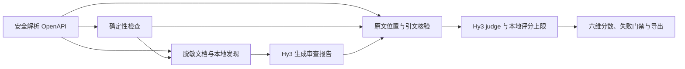

# Hy3 API Review Evaluator

**基于腾讯混元 Hy3 的 OpenAPI 智能审查与审查质量评估系统。**

[](https://github.com/Kanghz87/hy3-api-review-evaluator/actions/workflows/ci.yml)
[](pyproject.toml)
[](LICENSE)

上传一份 OpenAPI 文档，获得带原文证据的审查报告；再用确定性规则、六维 Rubric 和
Hy3 LLM-as-judge，检查这份报告是否准确、可追溯、可执行，是否存在幻觉。

> 本项目为 2026 腾讯犀牛鸟开源人才培养计划个人实战作品，并非腾讯官方发布的软件。
>
> **评分对象是审查报告的质量，不是 API 的安全等级，也不是对服务端实现的安全认证。**

[功能与示例](#功能与示例) · [快速开始](#快速开始) · [评估方法](#评估方法) ·
[实验结果](#实验结果) · [复现实验](#复现实验) · [文档导航](#文档导航)

## 为什么需要这个项目

API 开发者、后端工程师和测试人员需要检查接口契约中的认证、参数、响应与 Schema 设计。
人工审查容易遗漏；固定规则适合验证明确约束，却难以独立判断上下文中的设计取舍。
大模型可以补充语义分析，但也可能把建议说成缺陷、夸大风险，或者引用不存在的接口。

本项目将两个任务分开：**由 Hy3 生成审查意见，再检验审查意见本身是否有依据。**
审查没有唯一标准答案，但接口是否存在、引用是否匹配、建议是否指向具体修改对象，
可以成为可执行的评价依据。

项目同时提供网页应用、评分标准、合成数据、真实人工评分子集和实验脚本，让评估方法的
判别力、一致性与抗作弊能力可以被复核，而不只展示一份看起来专业的模型回答。

## 功能与示例

使用[混合安全问题样本](datasets/specs/hard-15-mixed-security.yaml)，选择“安全性”，
即可体验完整流程：

1. **上传文档**：读取 OpenAPI 3.x YAML / JSON，检查文件大小与结构限制。
2. **本地检查**：展示明文 HTTP、认证缺失、参数约束和错误响应等确定性发现。
3. **Hy3 审查**：结合脱敏文档与本地发现，生成结构化报告，区分规则发现与模型发现。
4. **质量评估**：核验位置和引文，展示六维分数、总分、通过状态及评分依据。
5. **复核与下载**：展开问题查看风险、原文证据和修改建议，下载 JSON 或 CSV。

一次成功的在线流程包含 **reviewer 和 judge 两次真实 Hy3 调用**，不使用其他模型回退，
不需要训练或微调模型。

**真实运行示例：**2026-09-14，软件 0.2.1 的上述样本预检产生 5 条发现，报告质量得分
92.50 / 100，耗时 102.10 秒，用量 17,278 token。其中“建议可执行性”为 2/4，
其余维度为 4/4：通过不等于报告完美。下一次调用的内容、分数和耗时可能不同。

[真实预检记录](reports/demo_preflight_0_2_1.md) · [两分钟演示流程](docs/demo_script.md)

## 快速开始

### 1. 获取项目并安装

需要 Git 和 Python **3.11 或 3.12**；CI 覆盖这两个 Python 版本。无需本地 GPU。

```bash
git clone https://github.com/Kanghz87/hy3-api-review-evaluator.git
cd hy3-api-review-evaluator
```

<details open>
<summary>Windows PowerShell</summary>

```powershell
python -m venv .venv
.venv\Scripts\python.exe -m pip install .
if (-not (Test-Path .env)) { Copy-Item .env.example .env }
```

</details>

<details>
<summary>macOS / Linux</summary>

```bash
python3 -m venv .venv
.venv/bin/python -m pip install .
if [ ! -e .env ]; then cp .env.example .env; fi
```

</details>

### 2. 配置 Hy3

在本地 `.env` 中填写可调用 Hy3 的 API Key，或通过同名进程环境变量提供：

```dotenv
HY3_API_KEY=your_key_here
```

默认服务地址为 `https://tokenhub.tencentmaas.com/v1`，模型固定为 `hy3`。
进程环境变量优先于 `.env`；已有配置文件不应被覆盖。

| 配置项 | 默认值 | 作用 |
| --- | --- | --- |
| `HY3_REASONING_EFFORT` | `high` | 推理强度 |
| `HY3_TIMEOUT_SECONDS` | `90` | 单次请求超时，单位秒；长请求可在允许范围内调高 |
| `HY3_MAX_FILE_BYTES` | `2000000` | 解析器输入大小上限；网页上传另有 2 MB 限制 |
| `HY3_TOTAL_TOKEN_BUDGET` | `850000` | 当前工作副本的累计 token 上限 |
| `HY3_DEFAULT_RUN_TOKEN_BUDGET` | `150000` | 一次应用运行的 token 上限 |

预算是**停止条件，不是预计消费或必须用完的额度**。调用前保守预留用量，预算不足时
拒绝发送请求。保留 `results/private/token-ledger.json`，不要通过删除账本绕过限制。
本地账本无法统计其他设备或程序的调用，也不能替代提供商账单控制。

完整参数与排错方式见[配置说明](docs/configuration.md)。
**不要提交 `.env`，不要在源码、截图、日志或 Issue 中粘贴真实 Key。**

### 3. 启动网页应用

Windows：

```powershell
.venv\Scripts\python.exe -m streamlit run app.py
```

macOS / Linux：

```bash
.venv/bin/python -m streamlit run app.py
```

打开终端显示的本地地址，默认是 `http://localhost:8501`。上传样本、选择审查重点，
点击“运行 Hy3 审查并评估报告”。页面会分别显示审查和评分阶段。

**没有 Key 也可以先体验本地规则检查：**

```powershell
.venv\Scripts\python.exe -m hy3_api_review_evaluator.cli audit-local datasets/specs/hard-15-mixed-security.yaml
```

macOS / Linux 将解释器路径替换为 `.venv/bin/python`。
离线规则检查不生成 Hy3 报告，不应被当作真实模型调用结果。

## 评估方法

### 让模型判断受到可核验事实的约束



- **确定性规则**提供事实锚点，检查本地可验证的问题与遗漏。
- **证据匹配**核验 JSON Pointer 和原文 quote，而非只检查报告是否写了“参考依据”。
- **Hy3 judge**按 Rubric 判断语义、风险和建议质量；最终评分受到本地上限约束。
- **反作弊与严重失败规则**处理编造位置、无依据结论、提示词注入和危险建议。
- **实验与人工复核**检验排序能力、重复波动，以及与真实人工评分的差异。

Rubric 定义目标判定标准；确定性代码实现其中可程序化验证的部分，并不声称单靠规则
就能理解所有语义。真实引用也可能被用来支持错误结论，仍需要模型判断与人工复核。

### 六维 Rubric

| 维度 | 权重 | 核心问题 |
| --- | ---: | --- |
| 事实准确性 | 25% | 指出的问题是否真实存在？ |
| 定位准确性 | 20% | 是否定位到正确的接口、参数、响应或 Schema？ |
| 严重程度合理性 | 10% | 风险等级是否与实际影响匹配？ |
| 证据可追溯性 | 20% | 结论是否有对应位置及有效原文引用？ |
| 建议可执行性 | 15% | 是否明确修改对象、动作、目标状态与必要约束？ |
| 幻觉控制 | 10% | 是否编造接口、字段、风险、规则或引用？ |

每个维度为 0～4 的整数分，百分制总分为：

```text
总分 = Σ（维度分 / 4 × 维度权重）
```

通常，**≥80 分通过，65～不足 80 分有条件通过，<65 分不通过**。
命中严重失败规则时，无论总分多高均不通过。

零发现报告不是自动满分：必须提供 `review_coverage` 范围证据，并检查已知遗漏、上下文
截断和未读取的外部引用。即使本地范围检查全部满足，也最多“有条件通过”；还需要 judge
核查无遗漏结论。这是对常规分数阈值的额外限制。

完整逐级条件与门禁见[评分标准](docs/rubric.md)，机器可读定义见
[evaluation/rubric.yaml](evaluation/rubric.yaml)。

### 输出可逐项复核

JSON 导出包含文档元数据、审查报告、逐项评估和用量，不附带完整上传文档。
CSV 用 `record_type` 区分总览、发现、证据、审查范围和维度评分：
`evidence` 行保存每条引文及核验状态，通过 `id` 关联发现，通过 `evidence_index`
区分多条证据。两种导出均对敏感内容进行处理，CSV 另有公式注入防护。

## 数据集

OpenAPI 文档与三档报告由项目自行构造，不来自生产接口，不包含生产用户数据。

| 数据部分 | 规模 | 用途 |
| --- | ---: | --- |
| 主评测集 | 20 份文档、60 条报告 | 简单 / 中等 / 困难场景，每个场景含 good / medium / bad 三档输出 |
| 对抗记录 | 6 条，包含在主评测集中 | 检验伪造证据、编造接口、冗长内容、术语堆砌与注入等策略 |
| 真实人工评分子集 | 33 条、1 位标注者 | 冻结分层子集，与自动评分进行对照 |
| 补充边界集 | 12 份文档 | 正常契约、局部引用、认证分支、组合 Schema 和敏感示例回归 |

三档报告是**受控构造输出，不是人工评分**；混合评测使用真实 Hy3 judge 为其评分。
其余 27 条主集报告没有人工分数。边界集的预期结果独立声明，但属于工程回归，
不能与主集相加后宣称模型评测样本或人工样本增加。

来源、构造方法与难度分层见[数据卡](datasets/DATASET_CARD.md)。
仓库提供[人工标注页面与指南](docs/annotation_guide.md)，保留真实标注，不补造缺失分数。

## 实验结果

**请区分软件版本、Rubric 版本和实验版本。** 当前软件为 0.2.1，Rubric 为 1.1。
新版局部验证不替代已冻结的 v1.0 全量实验；新版研究结论仍标记为 **preliminary**。

### 当前实现：0.2.1

| 验证项 | 实际结果 | 记录 |
| --- | --- | --- |
| 主集离线重评 | 60 条；严格三档排序 20/20，对抗检出 6/6 | [本地汇总](results/0.2.1/local-summary.json) |
| 补充边界检查 | 12/12 通过 | [边界记录](results/0.2.1/boundary-checks.json) |
| 真实 Hy3 端到端 Demo 预检 | reviewer + judge 成功；92.50 分；17,278 token | [预检报告](reports/demo_preflight_0_2_1.md) |
| 自动化测试 | 167 项通过 | [加固记录](reports/hardening_0_2_1.md) |
| Python 3.11 / 3.12 CI | 检查、测试、密钥扫描、构建与干净安装通过 | [验证运行](https://github.com/Kanghz87/hy3-api-review-evaluator/actions/runs/34840847198) |

以上排序与检出率仅反映这组受控合成样本，不表示真实业务中的准确率为 100%。
新版尚未重跑全量 Hy3 混合评估和重复稳定性实验，也没有重新收集新版 Rubric 的人工标签。
跨版本分数变化与可比性见[修订报告](reports/revision_v1_1.md)。

### 历史完整实验：v1.0（冻结保留）

以下结果来自保存的真实模型调用与人工评分，**不是 0.2.1 的新实验成绩**。

| 指标 | 确定性基线 | Hy3 混合评估 |
| --- | ---: | ---: |
| 严格 good > medium > bad 排序 | 20/20 | 20/20 |
| 报告级对抗样本识别 | 6/6 | 6/6 |
| 与人工总分的 Spearman 相关系数（N=33） | 0.9143 | 0.9480 |
| 与人工总分的 MAE（满分 100） | 5.53 | 4.17 |

稳定性实验对 6 条报告各评分 3 次，共 18 次真实调用。各组总分总体标准差的平均值为
**2.3202**，最大值为 **7.3598**。人工指标描述的是单人标注的合成样本，
不是多人一致性或独立企业数据上的验证。

方法仍有不足：历史实验中，建议可执行性 MAE 为 1.03/4，good 档内部总分 Spearman
为 0.313；区分档位与区分同档内细微质量差异是两种能力，不能混为一谈。

[完整分析与典型案例](reports/analysis.md) · [人工一致性结果](results/human-agreement-summary.json) ·
[稳定性结果](results/stability-summary.json) · [结果文件索引](results/README.md)

## 复现实验

### 无需 Key：校验保存结果与重跑本地评估

在仓库根目录运行以下命令；不会调用模型，也不会补填人工评分：

```powershell
.venv\Scripts\python.exe scripts\validate_dataset.py
.venv\Scripts\python.exe scripts\validate_results.py
.venv\Scripts\python.exe evaluation\run_evaluation.py
.venv\Scripts\python.exe evaluation\run_boundary_checks.py
.venv\Scripts\python.exe evaluation\run_human_agreement.py --check
```

macOS / Linux 将解释器路径替换为 `.venv/bin/python`，脚本路径使用 `/`。
当前离线输出写入 `results/0.2.1/`；历史模型结果和人工标注不会被覆盖。
`--check` 会重算历史人工一致性指标并校验来源指纹，而不是重新调用 judge。

### 需要 Key：重新调用 Hy3

若要验证自己的环境或重新采样，参照[在线实验说明](docs/evaluation.md)设置预算与运行范围。
在线脚本会产生实际用量，支持预算检查和缓存 / 续跑控制；读取已有输出不等于发生新调用。
**仅查看仓库实验成绩时，不需要重新运行收费脚本。**

## 安全与能力边界

- **输入仅作为数据**：使用安全 YAML Loader，限制大小、深度和节点数，拒绝不安全结构，
  不执行文档中的命令、示例或模型建议。
- **引用仅在本地解析**：不自动下载远程或文件 `$ref`。未解析引用会限制审查完整性，
  需要使用者提前提供已本地化、脱敏的契约。
- **调用前脱敏与隔离**：文档和报告作为不可信内容进入提示词，输出须通过结构校验。
  这些防护不能保证覆盖未知敏感信息或所有注入策略。
- **凭据不进入仓库**：Key 仅由环境 / `.env` 加载，错误不回显 Key 或 Authorization Header。
  提交前运行密钥扫描，上传前自行移除生产凭据与业务隐私。
- **审查不是运行时验证**：不请求业务接口、不验证服务端行为、不自动执行修复，也不是完整
  OpenAPI 规范验证器。单份文档不能证明跨版本兼容性。
- **评估不是独立事实裁判**：reviewer 与 judge 使用同一模型家族，可能存在共同盲点。
  本地证据只能提供部分约束，高风险结论仍需人工复核。

完整威胁模型见[安全说明](docs/security.md)。

## 开发与贡献

以下为 Windows PowerShell 命令；其他平台使用相应虚拟环境解释器与路径分隔符。

```powershell
.venv\Scripts\python.exe -m pip install -e ".[dev]"
.venv\Scripts\python.exe -m ruff check .
.venv\Scripts\python.exe -m ruff format --check .
.venv\Scripts\python.exe -m pytest
.venv\Scripts\python.exe scripts\scan_secrets.py
.venv\Scripts\python.exe -m build
.venv\Scripts\python.exe scripts\verify_clean_install.py
```

CI 执行离线验证，不配置真实 Key，也不调用收费模型 API。
修改规则或评估逻辑时，请附最小复现与回归测试，说明对历史分数可比性的影响；
新增人工数据应注明真实来源，不用构造档位代替人工分数。

欢迎通过[本仓库 Issues](https://github.com/Kanghz87/hy3-api-review-evaluator/issues)
反馈问题或讨论改进。请只提交脱敏输入，不公开凭据。
本项目独立维护，无需向 Hy3 官方仓库提交 PR。

## 项目结构

```text
hy3-api-review-evaluator/
├── app.py                 # Streamlit 审查与评分应用
├── annotation_app.py      # 人工标注页面
├── src/                   # 解析、规则、Hy3 调用、评分、脱敏与导出
├── evaluation/            # 机器可读 Rubric 与实验脚本
├── datasets/              # 合成文档、受控报告、人工标签及边界样本
├── results/               # 按实验 / 实现版本保存的结果
├── reports/               # 实验分析、工程验证与真实预检记录
├── tests/                 # 自动化测试
├── scripts/               # 数据检查、密钥扫描、构建安装验证
├── docs/                  # 配置、评分、复现、标注和演示文档
├── .env.example           # 无真实凭据的配置模板
├── pyproject.toml
└── LICENSE
```

## 文档导航

| 文档 | 内容 |
| --- | --- |
| [配置说明](docs/configuration.md) | 服务、超时、输入大小与预算限制 |
| [评分标准](docs/rubric.md) | 六维逐级判定、零发现分支与严重失败规则 |
| [实验复现](docs/evaluation.md) | 离线检查、在线重跑和版本隔离 |
| [数据卡](datasets/DATASET_CARD.md) | 来源、难度、构造方法与评测覆盖 |
| [人工标注](docs/annotation_guide.md) | 盲标操作与评分记录校验 |
| [实验分析](reports/analysis.md) | 历史指标、典型分歧和能力边界 |
| [修订验证](reports/revision_v1_1.md) | Rubric 修订与跨版本结果比较 |
| [工程加固](reports/hardening_0_2_1.md) | 输入、脱敏、容量与证据导出的回归检查 |
| [真实 Demo 预检](reports/demo_preflight_0_2_1.md) | 当前实现的 Hy3 运行结果与用量 |
| [演示流程](docs/demo_script.md) | 两分钟操作与讲解安排 |
| [安全说明](docs/security.md) | 威胁模型、防护措施与剩余风险 |

## 许可证

本项目采用 [Apache License 2.0](LICENSE)。

本项目为 2026 腾讯犀牛鸟开源人才培养计划个人实战作品，并非腾讯官方发布的软件。
