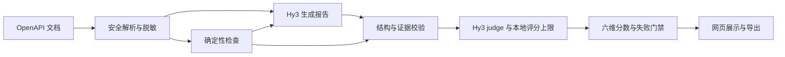

# Hy3 API Review Evaluator

[](https://github.com/Kanghz87/hy3-api-review-evaluator/actions/workflows/ci.yml)
[](pyproject.toml)
[](LICENSE)

**基于腾讯混元 Hy3 的 OpenAPI 智能审查与审查质量评估系统。**

Hy3 API Review Evaluator 将确定性规则、文档证据校验与 Hy3 LLM-as-judge 结合，用于生成
OpenAPI 审查报告，并评价报告的事实、定位、风险判断与修改建议是否可信。项目同时提供
Streamlit 应用、六维评分 Rubric、合成评测集和可复现的实验流程，面向 API 开发者、测试工程师
及 API 治理与大模型评估研究者。

> 系统评分的对象是**审查报告的质量**，不是 API 本身的安全等级，也不构成对服务端实现的安全认证。

[快速开始](#快速开始) · [评估方法](#评估方法) · [实验结果](#实验结果) ·
[复现实验](#复现实验) · [文档](docs/README.md)

## 核心功能

- **OpenAPI 审查**：接收 OpenAPI 3.x YAML / JSON，支持安全性、设计质量、可靠性、兼容性和
  开发者体验等审查重点；先执行本地检查，再由 Hy3 生成结构化报告。
- **证据校验**：以 JSON Pointer 定位文档节点，检查原文引用，标记错误定位、伪造证据与编造接口。
- **混合质量评估**：六维 0～4 分 Rubric、加权总分与严重失败门禁共同约束结果；模型评分不能
  突破本地校验给出的上限。
- **交互与导出**：在网页中查看问题、风险等级、文档证据和修改建议，下载 JSON / CSV 结果。
- **评测与人工复核**：提供 20 个合成场景、60 条受控报告、人工盲标页面，以及判别力、人工
  一致性、重复稳定性和对抗性实验脚本。

## 快速开始

### 环境要求

- Python 3.11 或 3.12；CI 覆盖这两个版本。
- Git；Windows、macOS 或 Linux 环境。
- 使用在线审查时，需要可调用 Hy3 的腾讯云 TokenHub API Key。离线校验与指标复现不需要 Key。

### 1. 安装

```bash
git clone https://github.com/Kanghz87/hy3-api-review-evaluator.git
cd hy3-api-review-evaluator
```

<details open>
<summary>Windows PowerShell</summary>

```powershell
python -m venv .venv
.venv\Scripts\python.exe -m pip install .
Copy-Item .env.example .env
```

</details>

<details>
<summary>macOS / Linux</summary>

```bash
python3 -m venv .venv
.venv/bin/python -m pip install .
cp .env.example .env
```

</details>

复制配置文件仅用于首次安装；已有 `.env` 时应跳过复制，保留原配置。

### 2. 配置 Hy3

在本地 `.env` 中填写 API Key，也可以通过进程环境变量提供：

```dotenv
HY3_API_KEY=your_key_here
```

默认服务地址为 `https://tokenhub.tencentmaas.com/v1`，模型固定为 `hy3`。项目使用兼容客户端
访问 Hy3，不使用其他模型回退。Key 不应写入源码、提交记录、截图或日志；`.env` 已被 Git 忽略。

超时、输入大小与 token 预算等配置见[配置说明](docs/configuration.md)和
[环境变量模板](.env.example)。

### 3. 启动应用

Windows：

```powershell
.venv\Scripts\python.exe -m streamlit run app.py
```

macOS / Linux：

```bash
.venv/bin/python -m streamlit run app.py
```

打开终端输出的本地地址，完成以下操作：

1. 上传 OpenAPI 文档，可使用仓库内的[混合安全问题示例](datasets/specs/hard-15-mixed-security.yaml)。
2. 选择审查重点，查看本地规则发现的问题。
3. 点击“运行 Hy3 审查并评估报告”。
4. 查看六维评分、逐项证据与修改建议，下载 JSON 或 CSV。

一次成功的在线流程包含两次 Hy3 调用：生成报告和评价报告，均会产生实际 token 用量。
输入默认限制为 2,000,000 字节；页面展示和导出的内容不会被自动执行。

## 评估方法

系统将“生成审查意见”与“验证审查质量”分开处理：



| 评分维度 | 权重 | 核查内容 |
| --- | ---: | --- |
| 事实准确性 | 25% | 报告指出的问题是否真实存在 |
| 定位准确性 | 20% | 路径、方法、参数、响应或 Schema 是否定位正确 |
| 严重程度合理性 | 10% | 风险等级是否与可验证的影响相符 |
| 证据可追溯性 | 20% | 结论能否对应到文档原文与有效引用 |
| 建议可执行性 | 15% | 建议是否明确修改对象、动作、目标状态与必要约束 |
| 幻觉控制 | 10% | 是否编造接口、字段、风险、规则或引用 |

每个维度取整数 0～4，按下式换算为百分制：

```text
总分 = Σ（维度分 ÷ 4 × 权重）
```

总分不低于 80 为通过，65～不足 80 为有条件通过，低于 65 为不通过。命中严重失败规则时，
无论总分多少均不通过。完整的 30 条评分条件和失败规则见[评分标准](docs/rubric.md)；
机器可读定义见 [rubric.yaml](evaluation/rubric.yaml)。

本地校验约束模型的可评分范围，但 JSON Pointer 存在、引用匹配并不等于结论在语义上成立。
因此，评估仍需结合 Hy3 judge 和人工复核，不能仅凭引用格式判定报告正确。

## 实验结果

评测集由 **20 份合成 OpenAPI 文档和 60 条受控构造报告**组成，每个场景包含 good / medium /
bad 三档。混合评估使用真实 Hy3 judge 对这些报告评分；应用的报告生成流程另有真实端到端
验证记录。人工一致性基于其中 33 条冻结分层记录，由一名维护者通过标注界面完成评分。

以下指标来自仓库保存的实际执行结果：

| 指标 | 确定性基线 | Hy3 混合评估 |
| --- | ---: | ---: |
| 严格 good > medium > bad 排序准确率 | 100%（20/20） | 100%（20/20） |
| 报告级对抗样本识别率 | 100%（6/6） | 100%（6/6） |
| 与人工总分的 Spearman 相关系数（N=33） | 0.9143 | 0.9480 |
| 与人工总分的平均绝对误差（满分 100） | 5.53 | 4.17 |
| 与人工总分相差不超过 5 分 | 25/33 | 26/33 |

重复稳定性实验对 6 条报告各评分 3 次，共 18 次真实调用；各组总分总体标准差的平均值为
2.3202，最大值为 7.3598。仓库公开的应用验证、混合评测和稳定性实验记录累计包含 84 次
Hy3 调用，共 211,101 token；录制前私有预检不会改写这些历史实验记录。

**结果适用范围：**上述排序与识别率仅描述该合成评测集；人工指标不是多人一致性或独立外部
测试。33 条报告共享 20 个场景，其余 27 条没有人工分数。混合方法并非所有维度都优于基线：
建议可执行性的 MAE 为 1.03/4，good 档内部 Spearman 为 0.313，仍存在建议评分偏保守和
同档细粒度排序能力有限的问题。

实验设计、按难度统计、典型失败案例与局限性见[完整分析报告](reports/analysis.md)。
原始结果及逐条人工对照见 [results](results/)，样本来源和构造方法见[数据卡](datasets/DATASET_CARD.md)。

## 复现实验

仓库包含已保存的模型输出和匿名化人工评分。以下命令仅使用本地数据，不调用 Hy3：

```powershell
.venv\Scripts\python.exe scripts\validate_dataset.py
.venv\Scripts\python.exe scripts\validate_results.py
.venv\Scripts\python.exe evaluation\run_evaluation.py
.venv\Scripts\python.exe evaluation\run_human_agreement.py --check
```

macOS / Linux 将 `.venv\Scripts\python.exe` 替换为 `.venv/bin/python`。

- 确定性评测会重新生成基线结果，并检查三档报告的排序表现。
- 人工一致性检查会重算指标、核对已保存结果与来源文件指纹，不补填或修改人工分数。
- 重新调用 Hy3 的实验与离线复算是两种不同流程；在线脚本具有预算限制和断点续跑行为。

在线评测、结果文件说明及重新采样注意事项见[实验复现指南](docs/evaluation.md)。
新增人工评分的操作见[标注指南](docs/annotation_guide.md)。

## 安全与能力边界

- API Key 仅从环境变量或本地 `.env` 读取；错误输出不包含 Key、Authorization Header 或提供商响应体。
- 使用安全 YAML Loader，拒绝 alias，并限制文件大小、对象节点数和嵌套深度。
- 不自动下载远程或文件 `$ref`；不调用文档中的业务接口，不执行文档命令或模型建议。
- 发送模型请求前脱敏，并将文档、示例和报告作为不可信数据隔离；CSV 导出防护公式注入。
- 本地规则不是完整的 OpenAPI 规范验证器；单份文档审查不能证明版本兼容性或服务端实现正确。
- 脱敏和提示词隔离不能保证覆盖所有未知敏感信息或攻击；上传前仍需移除生产凭据与业务隐私。

完整威胁模型与剩余风险见[安全说明](docs/security.md)。

## 开发与测试

安装开发依赖后运行检查，以下为 Windows PowerShell 命令：

```powershell
.venv\Scripts\python.exe -m pip install -e ".[dev]"
.venv\Scripts\python.exe -m ruff check .
.venv\Scripts\python.exe -m ruff format --check .
.venv\Scripts\python.exe -m pytest
.venv\Scripts\python.exe scripts\scan_secrets.py
.venv\Scripts\python.exe -m build
.venv\Scripts\python.exe scripts\verify_clean_install.py
```

macOS / Linux 使用 `.venv/bin/python` 作为解释器。CI 在 Python 3.11 和 3.12 上执行代码检查、
测试、密钥扫描、数据校验、指标复现、构建和干净环境安装，不调用收费模型 API。

问题反馈与改进建议可提交到[本仓库 Issues](https://github.com/Kanghz87/hy3-api-review-evaluator/issues)。
涉及规则或评估逻辑的变更应附测试，并注明对历史实验可比性的影响；请勿在 Issue 中上传真实凭据。

## 文档

| 文档 | 内容 |
| --- | --- |
| [配置说明](docs/configuration.md) | 环境变量、运行限制与预算行为 |
| [评分标准](docs/rubric.md) | 六维 Rubric 与严重失败规则 |
| [实验复现指南](docs/evaluation.md) | 离线复算、在线评测与结果文件 |
| [数据卡](datasets/DATASET_CARD.md) | 样本来源、构造方法与标注协议 |
| [人工标注指南](docs/annotation_guide.md) | 盲标流程与评分记录校验 |
| [分析报告](reports/analysis.md) | 实验结果、分歧案例与能力边界 |
| [Demo 前审计](reports/pre_demo_audit.md) | 最新工程复验与正式样本真实 Hy3 预检 |
| [安全说明](docs/security.md) | 威胁模型与风险控制 |
| [演示流程](docs/demo_script.md) | 两分钟应用演示步骤 |

## 许可证与项目声明

本项目采用 [Apache License 2.0](LICENSE) 许可证。

本项目为 2026 腾讯犀牛鸟开源人才培养计划个人实战作品，并非腾讯官方发布的软件。
